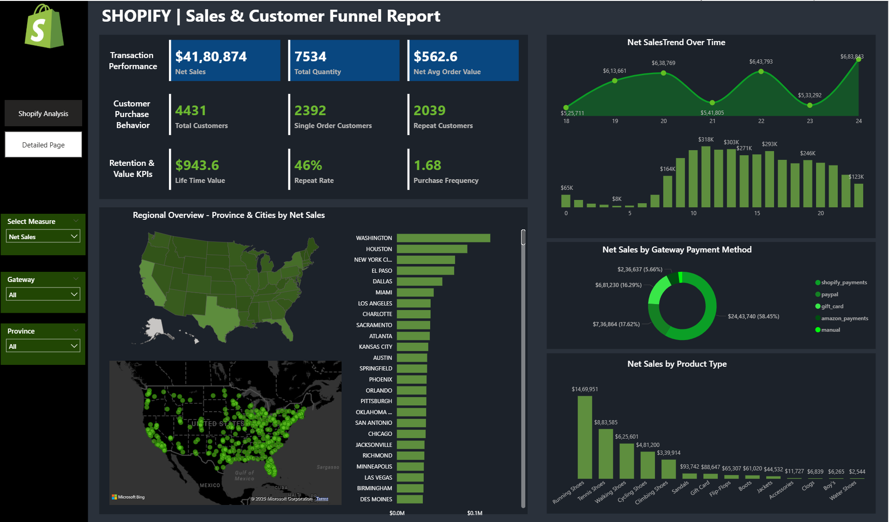

# Shopify_Analysis 
# 🛍️ Shopify | Sales & Customer Funnel Report - Power BI Dashboard

## 📊 Overview

This Power BI dashboard visualizes Shopify e-commerce performance data and provides insights into:

- **Transaction Performance**
- **Customer Purchase Behavior**
- **Retention & Value KPIs**
- **Regional Sales Distribution**
- **Sales Trends Over Time**
- **Payment Method Breakdown**
- **Product-wise Sales Analysis**

## ✅ Key Highlights

- 💰 **Net Sales**: $4,180,874  
- 📦 **Total Quantity Sold**: 7,534  
- 📈 **Net Avg Order Value**: $562.6  
- 👥 **Total Customers**: 4,431  
- 🔁 **Repeat Rate**: 46%  
- 🔂 **Purchase Frequency**: 1.68  
- 🌍 **Regional Drilldown** by Province, City, and Payment Gateway  
- 📅 **Trend Line** of Net Sales Over Time  
- 🔍 **Product Type & Payment Method Analysis**

## 📌 Features

- Dynamic slicers for:
  - **Measure Selection** (`Net Sales`, etc.)
  - **Payment Gateway Filter**
  - **Province Filter**
- Interactive visuals including:
  - Line & bar charts
  - Map visuals (State & City level)
  - Donut chart for gateway sales distribution

## 📁 Project Structure(Shopify_Analysis.pbix)

## 🧰 Tools Used

- **Power BI**
- **DAX**
- **Data Modeling**
- **Geo Mapping (Bing Maps Integration)**

## 🚀 Purpose

This dashboard was designed to help Shopify-based businesses understand:
- Sales performance across regions and time
- Customer behavior (new vs repeat)
- Product category performance
- Gateway-wise revenue breakdown

## 📬 Contact

If you'd like a similar dashboard tailored to your business or dataset, feel free to reach out via [LinkedIn]([#](https://www.linkedin.com/in/ihsan-hasan-v-20166420b/)) or email at [yourname@example.com](mailto:ihsanbinhameed@gmail.com).

---

